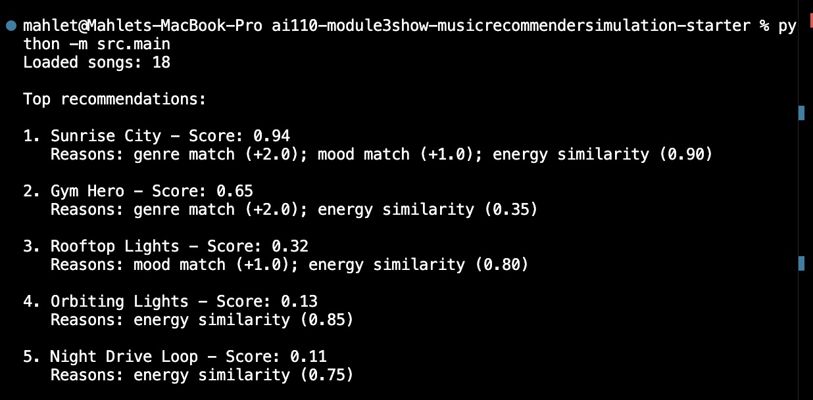
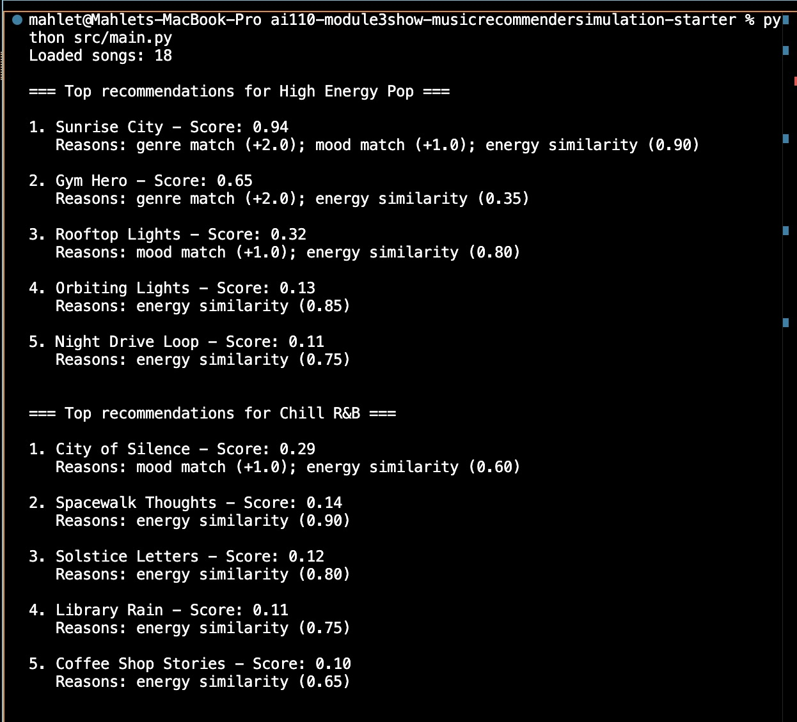
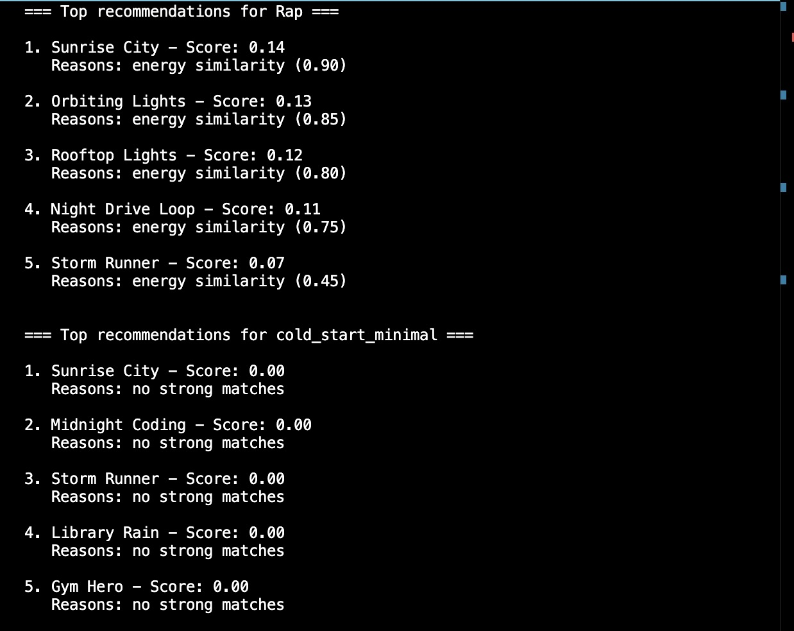
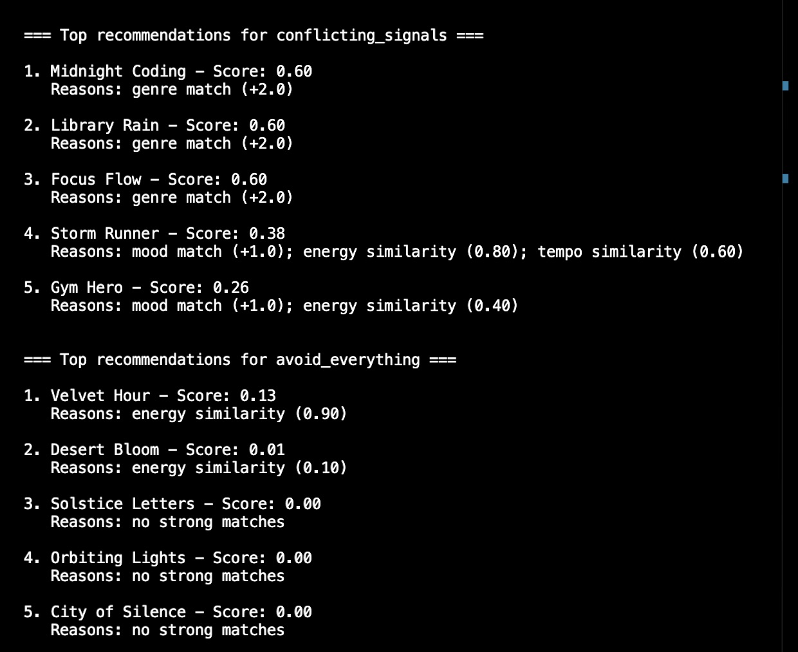

# 🎵 Music Recommender Simulation

## Project Summary

In this project you will build and explain a small music recommender system.

Your goal is to:

- Represent songs and a user "taste profile" as data
- Design a scoring rule that turns that data into recommendations
- Evaluate what your system gets right and wrong
- Reflect on how this mirrors real world AI recommenders

My version loads a small song catalog from CSV, builds a user taste profile, and scores each song with a simple weighted formula. It returns the top K recommendations and explains why they were chosen. The focus is on transparency: you can see how genre, mood, and numeric features influence each result.

---

## How The System Works

Explain your design in plain language.

Some prompts to answer:

- What features does each `Song` use in your system
  - For example: genre, mood, energy, tempo
- What information does your `UserProfile` store
- How does your `Recommender` compute a score for each song
- How do you choose which songs to recommend

You can include a simple diagram or bullet list if helpful.

Real-world recommendations combine listening behavior, similarity between users and items, and ranking rules to decide what appears next, often balancing accuracy with discovery. My version prioritizes transparent, content based matching: each Song uses genre, mood, energy, tempo, valence, danceability, and acousticness, and the UserProfile stores a preferred genre and mood plus target values for those numeric features. The Recommender computes a score for each song by rewarding closeness to the user's targets and giving extra weight to genre and mood matches, then it recommends the top scoring songs as the final list.

Features used:

- Song: genre, mood, energy, tempo, valence, danceability, acousticness.
- UserProfile: favorite genres, favorite moods, avoid genres, target values, tolerances, and weights.

Algorithm Recipe (scoring sheet):

Total Score =
(Genre Score _ 0.15) +
(Mood Score _ 0.20) +
(Energy Similarity _ 0.30) +
(Tempo Similarity _ 0.10) +
(Valence Similarity _ 0.10) +
(Danceability Similarity _ 0.10) +
(Acousticness Similarity \* 0.05)

- (Avoid Penalty)

* (Diversity Bonus)
* (Novelty Bonus)

Genre Score:

- +2.0 if genre in favorite genres
- -3.0 if genre in avoid genres
- 0 otherwise

Mood Score:

- +1.0 if mood in favorite moods
- 0 otherwise

Numeric Similarity (each feature):

- 1.0 if at target
- 0.5 if moderately close (within tolerance)
- 0.0 if outside tolerance

Avoid Penalty:

- 0.40 if genre is in avoid genres
- 0.0 otherwise

Diversity Bonus (applied during ranking):

- +0.05 if the song adds a new genre or mood to the top list

Novelty Bonus:

- +0.10 if genre is not in favorites and not in avoid list

Ranking rule:

- Score every song, sort by Total Score, then return Top K.

Potential biases and limitations:

- This system may over prioritize genre and miss songs that match mood and numeric features but are in non favorite genres.
- Hard tolerances can exclude near misses and reduce diversity if the profile is too narrow.

---

## Getting Started

### Setup

1. Create a virtual environment (optional but recommended):

   ```bash
   python -m venv .venv
   source .venv/bin/activate      # Mac or Linux
   .venv\Scripts\activate         # Windows

   ```

2. Install dependencies

```bash
pip install -r requirements.txt
```

3. Run the app:

```bash
python -m src.main
```

### Running Tests

Run the starter tests with:

```bash
pytest
```

You can add more tests in `tests/test_recommender.py`.

---

## Experiments You Tried

- I doubled the energy weight and cut the genre weight in half. Songs with closer energy matches rose in the ranking, even if the genre was not a perfect match.
- I tried a Happy Pop profile and noticed “Gym Hero” appeared often because high energy boosted it.
- I tested Chill Lofi and saw the model prefer low energy, slower tempo tracks as expected.

---

## Limitations and Risks

This system uses a tiny catalog, so it repeats the same songs across profiles. It does not understand lyrics, language, or artist loyalty. It can over favor one genre or a strict energy target and miss near matches.

You will go deeper on this in your model card.

---

## Reflection

Read and complete [**Model Card**](model_card.md).

My biggest learning moment was seeing how small weight changes can flip the top results, even with the same dataset. AI tools helped me draft scoring logic and explanations quickly, but I had to double check key names and weights to make sure the math matched the code. I was surprised that a simple weighted score can still feel like real recommendations when the features line up.

If I extended this project, I would add artist preferences, stronger diversity controls, and a larger dataset. I would also test more profiles and compare how rankings change when I adjust tolerances and penalties.

---

## 7. `model_card_template.md`

Combines reflection and model card framing from the Module 3 guidance. :contentReference[oaicite:2]{index=2}

```markdown
# 🎧 Model Card - Music Recommender Simulation

## 1. Model Name

Give your recommender a name, for example:

> VibeFinder 1.0

---

## 2. Intended Use

- What is this system trying to do
- Who is it for

Example:

> This model suggests 3 to 5 songs from a small catalog based on a user's preferred genre, mood, and energy level. It is for classroom exploration only, not for real users.

---

## 3. How It Works (Short Explanation)

Describe your scoring logic in plain language.

- What features of each song does it consider
- What information about the user does it use
- How does it turn those into a number

Try to avoid code in this section, treat it like an explanation to a non programmer.

---

## 4. Data

Describe your dataset.

- How many songs are in `data/songs.csv`
- Did you add or remove any songs
- What kinds of genres or moods are represented
- Whose taste does this data mostly reflect

---

## 5. Strengths

Where does your recommender work well

You can think about:

- Situations where the top results "felt right"
- Particular user profiles it served well
- Simplicity or transparency benefits

---

## 6. Limitations and Bias

Where does your recommender struggle

Some prompts:

- Does it ignore some genres or moods
- Does it treat all users as if they have the same taste shape
- Is it biased toward high energy or one genre by default
- How could this be unfair if used in a real product

---

## 7. Evaluation

How did you check your system

Examples:

- You tried multiple user profiles and wrote down whether the results matched your expectations
- You compared your simulation to what a real app like Spotify or YouTube tends to recommend
- You wrote tests for your scoring logic

You do not need a numeric metric, but if you used one, explain what it measures.

---

## 8. Future Work

If you had more time, how would you improve this recommender

Examples:

- Add support for multiple users and "group vibe" recommendations
- Balance diversity of songs instead of always picking the closest match
- Use more features, like tempo ranges or lyric themes

---

## 9. Personal Reflection

A few sentences about what you learned:

- What surprised you about how your system behaved
- How did building this change how you think about real music recommenders
- Where do you think human judgment still matters, even if the model seems "smart"
```

## Terminal Output








